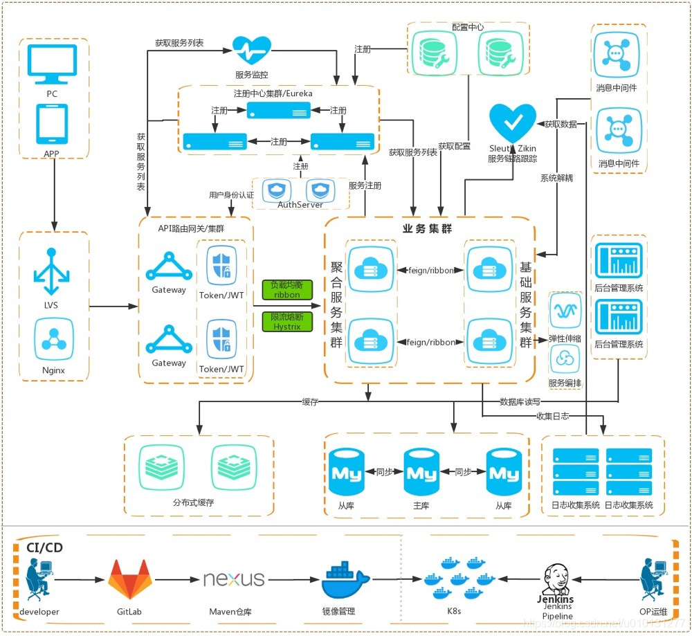
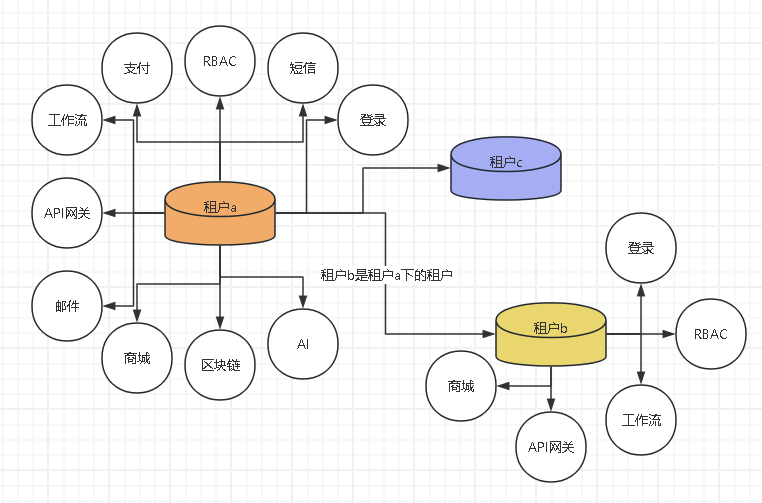
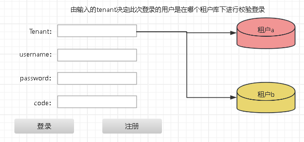
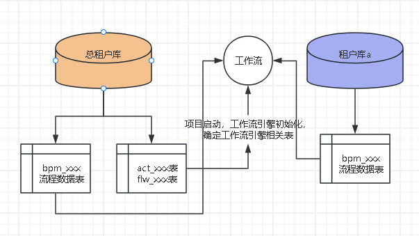

<h1 align="center" style="margin: 30px 0 30px; font-weight: bold;">氢信SaaS云基座</h1>
<h4 align="center">基于 Vue/React组件生态 和 Spring Cloud & Alibaba 前后端分离的分布式微服务架构</h4>

## 平台简介

​	氢信SaaS云基座是[福州夸克科技有限公司](doc/福州夸克科技有限公司公司简介.docx )针对企业应用数据资产（基于租户的数据管理），快速开发（以小时为单位的迭代），出海应用（多语言框架）的基座。

​	氢信SaaS基座在RuoYi开源项目的基础上进行升级开发，采用微服务架构和多租户设计，为企业客户提供高度可扩展的SaaS平台解决方案。核心功能涵盖RBAC权限管理、API网关、工作流引擎、数据隔离、支付集成及动态模块化配置等模块。为中大型企业提供灵活、可扩展的云服务解决方案，支持多租户管理、业务流程管理（BPM）、支付集成、区块链、商业智能（BI）和即时通讯（IM）等功能模块，毫无保留给个人及企业免费使用。

* 采用前后端分离的模式，后端采用Spring Cloud & Alibaba。
* 注册中心、配置中心选型Nacos，权限认证使用Redis。
* 流量控制框架选型Sentinel，分布式事务选型Seata。

​	**核心设计特征:**

- SaaS级基础设施建设：支持企业降维使用，并可扩展至大型开发团队。
- 多租户管理：支持租户级别的数据隔离和权限管理。
- 分布式网关配置：支持异构系统、灵活路由和数据隔离。
- 数据资产管理与即插即拔模块：实现动态加载模块及精准数据治理。
- 高可维护性与性能优化：通过分布式架构与监控系统实现模块化运维。

​	基于二十多年的 ERP 系统开发经验，我们发现传统的 ERP 系统中存在许多复杂问题，尤其是将 RuoYi 框架引入到已有系统中时，开发过程非常耗时且复杂，频繁地进行二次开发却难以满足需求。又经过4-5年的开发实践：[氢信平台宣传手册V3.0](doc/氢信平台宣传手册V3.0.pdf )，我们组建了一个20多人的团队，在开发过程中也遇到了一些挑战：

- 前端技术多样化问题：由于使用了多种前端技术框架，前后端集成变得复杂，维护成本增加。
- 后端多语言技术问题：后端涉及多种语言和技术栈，导致系统复杂度提升，开发效率下降。
- 业务代码膨胀：随着业务需求的不断增加，后端代码逐渐膨胀，维护和扩展变得越来越困难。

​	为了应对这些问题，我们决定重新打造一个全新的开源项目，旨在解决上述技术挑战、简化开发流程、提高系统的可维护性和可扩展性，面向中大型项目开发。

## 系统模块

~~~
com.qingxinsaas     
├── qingxinsaas-gateway         // 网关模块 [8080]
├── qingxinsaas-auth            // 认证中心 [9200]
├── qingxinsaas-api             // 接口模块
│       └── ruoyi-api-system                          // 系统接口
├── qingxinsaas-common          // 通用模块
│       └── qingxinsaas-common-core                         // 核心模块
│       └── qingxinsaas-common-datascope                    // 权限范围
│       └── qingxinsaas-common-datasource                   // 多数据源
│       └── qingxinsaas-common-log                          // 日志记录
│       └── qingxinsaas-common-redis                        // 缓存服务
│       └── qingxinsaas-common-seata                        // 分布式事务
│       └── qingxinsaas-common-security                     // 安全模块
│       └── qingxinsaas-common-swagger                      // 系统接口
│       └── qingxinsaas-common-tenant                       // SaaS多租户
│       └── qingxinsaas-common-mybatisplus                  // MybatisPlus
├── qingxinsaas-modules         // 业务模块
│       └── qingxinsaas-system                              // 系统模块 [9201]
│       └── qingxinsaas-gen                                 // 代码生成 [9202]
│       └── qingxinsaas-job                                 // 定时任务 [9203]
│       └── qingxinsaas-file                                // 文件服务 [9300]
│       └── qingxinsaas-apigateway                          // APIGateway服务 [9400]
│       └── qingxinsaas-flowable                            // Flowable工作流 [9500]
├── qingxinsaas-visual          // 图形化管理模块
│       └── qingxinsaas-visual-monitor                      // 监控中心 [9100]
├──pom.xml                // 公共依赖
~~~

## 架构图

## 五位一体（核心功能）

- **SaaS多租户**  

  

  多租户的数据隔离采用方案：

  DATASOURCE 模式：独立数据库

  一个租户一个数据库，这种方案的用户数据隔离级别最高，安全性最好。

  1. 层级关系

     •	租户A是上级租户，拥有对子租户B和C的管理权限。

     •	租户B和租户C是租户A的子租户，但它们之间相互独立。

  2. 权限授予

     •	租户A负责定义和分配租户B的基础权限（如角色和菜单）。

     •	租户B会将其最高权限账户信息同步给租户A和总租户，以便上级能监管和访问关键账户。

  3. 权限管理与隔离

     •	租户级权限隔离：租户B的所有用户、部门和岗位的权限设置仅在租户B的数据库中生效，其他租户（如租户C）无法访问。

     •	RBAC模型应用：租户B可独立管理自己的用户、部门、岗位和角色，按照自己的业务需求定义权限策略。

  4. 数据权限过滤

     •	部门、岗位、角色的权限过滤：这些数据访问规则只适用于租户B内部，即用户在租户B中的权限不会影响租户A或其他租户。

  **总结：**

  ​	在RBAC框架下，租户A定义和控制子租户B的权限边界，但租户B在此基础上具备对自己用户、部门和岗位的自主管理能力，并且所有权限控制严格限定在各自租户的数据范围内。

  **多数据源事务管理**

  ​	在租户 b 向租户 a 和总租户同步其最高权限账户信息时，涉及数据源切换与数据插入的操作。由于这种场景涉及多个数据源，需要确保事务的一致性。

  ​	在这种情况下，项目中可以使用 Dynamic Datasource 提供的 @DSTransactional 注解来实现多数据源下的事务管理。@DSTransactional 适用于单机环境下的多数据源操作，能够支持在同一个事务中切换数据源。相比传统的 @Transactional，@Transactional 在多数据源场景下无法自动切换数据源，而 @DSTransactional 可以有效解决这个问题。

  **避免分布式事务开销**

  ​	对于项目中仅涉及简单的数据源切换操作，可以避免引入分布式事务框架（如 Seata）。虽然 Seata 可以用于微服务架构中的分布式事务，但由于其较低的效率和较大的开销，在本项目中并不适合。因此，使用 @DSTransactional 注解可以更高效地处理多数据源的事务。

  ​	这样设计可以有效解决租户信息同步时多数据源切换的需求，同时避免了分布式事务带来的性能瓶颈。

- **RBAC权限管理**

  ​	为了在 RuoYi-Vue 框架下实现多租户环境中的权限管理，基于 RBAC 模型扩展了租户维度的权限设计，涉及以下几个核心表结构：

  - **sys_tenant（租户表）**

    存储租户的基础信息，如租户名称、状态、套餐类型等。每个租户都有唯一标识，以便区分不同租户的权限体系。

  - **sys_user_tenant（用户-租户关联表）**

    用于关联用户与租户的关系，记录用户属于哪个租户。一个用户可以属于多个租户，通过该表来实现多租户的用户身份管理。该表的关键字段包括用户 ID、租户 ID，以及用户在该租户中的角色或权限等级。

  - **sys_tenant_menu（租户-菜单权限表）**

    存储每个租户的菜单权限配置，控制租户能访问哪些功能模块。通过该表，租户可以根据其套餐类型或定制化需求，分配不同的菜单权限。

- **登录**

  

  - **租户区分**

    ​	在多租户系统中，用户登录时首先输入 Tenant 信息（即租户标识），系统根据这个 Tenant 确定要连接的租户数据库。这一过程在总租户库中查找该租户的配置信息，以动态切换到该租户的独立数据源

  - **身份验证**

    ​	用户（如 zhangsan）在租户 a 和租户 b 中密码相同，但登录时，系统会依据用户选择的 Tenant 来定位具体的租户库，然后在对应的租户库中校验用户的登录信息。因此，即便 zhangsan 在两个租户中的密码相同，系统仍会根据用户输入的 Tenant 来决定应该连接哪个租户库进行登录验证。

  - **权限控制**

    ​	RBAC 体系下，zhangsan 的权限是基于角色的，不同租户会为其分配不同的角色和权限。虽然用户 zhangsan 在租户 a 和租户 b 中可以成功登录，但他在两个租户中的权限取决于在每个租户中被分配的角色。也就是说，系统会从当前租户的数据库中获取他对应的角色及其权限信息，并根据这些角色来控制他在该租户下的操作权限。

    ​	-角色：每个租户为用户定义不同的角色，例如在租户 a 中可能分配 Admin 角色，而在租户 b 中可能分配 User 角色。

    ​	-权限：基于角色的权限差异，使得 zhangsan 在租户 a 中可能拥有管理员级别的权限，而在租户 b 中可能只有普通用户的权限。

  **总结：**

  ​	在 RBAC 框架下，尽管用户在多个租户中可以使用相同的凭据登录，但每个租户会为该用户分配独立的角色与权限，决定他在该租户下的访问控制策略。这种分离使得同一用户在不同租户的权限范围完全独立。

- **API网关**

  ​	API 网关的主要功能是将请求转发至由不同语言实现的 Restful API 服务。各租户的 Restful API 服务配置由总租户统一管理。

  ​	在氢信 SaaS 基座中，API 网关的核心作用是请求转发，且响应格式为 JSON。然而，面对大量 JSON 数据时，数据隔离难度较大。因此，数据隔离工作在其他服务中完成，处理后的数据再返回给基座，由基座最终返回给前端。

  ​	在转发请求时，API 网关会在请求头中添加相应的 Tenant 信息，其他服务通过该 Tenant 值切换数据源或进行数据隔离。经过隔离后的数据以 JSON 格式返回给基座，再由基座传递给前端。

- **Flowable工作流**

  

  ​	在项目中，Flowable 工作流引擎的核心表共用存储在总租户库中。项目启动时，工作流引擎会初始化并确定使用的工作流引擎表数据源，这一选择在初始化后不可更改。

  ​	为了实现流程数据的租户级隔离，在创建租户时，系统会为每个租户初始化独立的流程数据表。这样，每个租户的工作流数据可以存储在各自的表中，与其他租户完全隔离。具体设计如下：

  **工作流引擎表共用：**

  ​	工作流引擎的核心配置表（如流程定义、任务配置等）统一存放在总租户库中，确保全局的流程配置管理。这些表在项目启动时初始化并与总租户库绑定，后续不允许切换数据源。

  **流程数据表独立：**

  ​	为了确保租户的流程数据隔离，每当创建一个新租户时，系统会为该租户生成独立的流程实例数据表、任务数据表等。这些表用于存储该租户的工作流运行数据，确保不同租户之间的数据相互隔离，不会互相干扰。

  **租户级隔离优势：**

  ​	通过为每个租户初始化独立的流程数据表，能够实现以下目标：数据安全：不同租户的流程数据完全隔离，确保租户之间无法访问或影响彼此的数据。性能优化：租户独立的数据表设计有助于分散工作流引擎的负载，避免在大规模多租户场景下出现性能瓶颈。

  **设计灵活性：**
  
  ​	这种设计使得租户的流程数据隔离不仅局限于数据库逻辑层，也可以根据需要进一步实现物理数据库隔离，提供更多的部署和扩展灵活性。

## 开发规范

1. **代码规范**
   - 命名规范：采用驼峰命名法，方法名清晰表达功能；常量使用大写字母+下划线。
   - 注释规范：公共类和方法使用JavaDoc注释，关键逻辑需增加行内注释。
   - 版本控制：使用Git进行代码管理，采用Gitflow分支模型，功能开发分支命名为feature/xxx。
2. **设计规范**：
   - 遵循RESTful规范，所有API以复数形式命名，版本控制通过URL体现（如/api/v1/users）。
   - 统一异常处理机制，返回标准化的错误码和信息。
   - 表设计需遵循第三范式，字段命名与业务含义保持一致。
3. **测试规范：**
   - 单元测试：使用JUnit编写单元测试，确保测试覆盖率不低于80%。
   - 接口测试：通过Postman等工具测试所有RESTful接口，确保请求与响应的正确性。

## 部署与运维

1. **容器化与CI/CD集成：**
   - Docker与Kubernetes：实现服务容器化和自动编排。
   - Jenkins/GitHub Actions：支持自动构建、测试与发布。
2. **日志与监控：**
   - ELK与Prometheus：用于集中化日志管理及系统监控。
